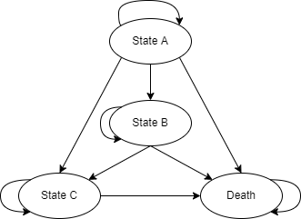

# DMHEE_HIV

The goal of this repo is to develop and execute the HIV model from the DMHEE 
textbook in a reproducible manner [^1]. This necessitated the creation of an 
automated workflow which was designed to capture the procedures of the 
economic evaluation as well as those used to estimate the parameter inputs 
[^scope]. 

This project was initiated in response to the fact that the original 
textbook exercises are designed and organized for a spreadsheet environment. 
Adapting these exercises to a programming language offered the ability to show 
how this model could be developed in a reproducible fashion. A collection of 
previously identified strategies for reproducibility were used to achieve a 
level of reproducibility that would allow for the reliable re-generation of 
results, including intermediate data sets. 

# Model Summary

The HIV model was originally developed for a cost-effectiveness analysis of 
zidovudine monotherapy compared with combination therapy of zidovudine and 
lamivudine. These strategies were compared in patients with HIV infection, and 
is originally reported in Chancellor et al. 1997[^2]. A summary of the model 
structure is presented in the figure below.

The diagram depicts a model which characterizes the prognosis of an HIV-positive 
patient in terms of four health states. Importantly, the model assumes that a 
patient cannot move to a less severe disease state. While this assumption may 
not be true today, this exercise is strictly meant as a teaching tool to 
illustrate the underlying methods.

State A
  : Less severe HIV state with CD4 cell count of 200-500 celss/mm^3. 

State B
  : More severe HIV state with CD4 cell count less than 200 cells/mm^3. 
  
State C
  : AIDS. 
  
State D
  : Death (Absorbing state).

For the purpose of this exercise, treatment effects are measured in terms of 
Life-Years. Meanwhile, costs are measured in terms of the annual treatment costs 
in hospital and community care settings.

## Model Parameters
:warning: Add a description of the model parameters here. 

# Project Organization
:warning: Provide an explanation of how the project is organized here. 

# Progress
:white_check_mark: Complete
:warning: In-Progress
:x: Ice-Box.

## :white_check_mark: Model Development

- :white_check_mark: Prepare parameter inputs from raw data | `getParams()`
  - :white_check_mark: Transition Probabilities. 
    - Add state transitions table for Monotherapy to `data/data-raw`.
      - File: `data/data-raw/StateTransitions_Count_Mono.rds`. 
    - Add relative risk of disease progression for combination therapy. 
      - Included in body of `getParams()`. 
  - :white_check_mark: Costs. 
    - Add annual costs for each health state to `data/data-raw`.
      - File: `data/data-raw/HIV_Annual-Costs.rds`.
    - Add treatment costs. AZT: 2278 GBP, LAM: 2087 GBP. 
      - Included in body of `getParams()`. 
- :white_check_mark: Develop model code. 
  - Organized into 3 separate call stacks. 
  - :white_check_mark: Function to generate simulation-ready model parameters 
  from raw data, `getParams()`.
    - Looks in the `data/data-gen/Model-Params` sub-directory for a data set. If 
    the directory is empty, the function will re-generate the parameters from 
    raw data and save it there. It will return a statement with a relative file 
    path to read the data into memory.
  - :white_check_mark: Function to draw parameter values from assigned 
  distributions, `DrawParams()`. 
    - This function is designed to support deterministic or probabilistic 
    analyses. If deterministic, mean values are returned for each parameter. If 
    probabilistic, a value is drawn for each assigned distribution. 
    - :white_check_mark: Function to define the transition matrix, 
    `define_tmat()`[^tmat]. 
    - :white_check_mark: Function to use method of moments technique to draw 
    random parameter values for costs, `MoM_Costs()`. 
  - :white_check_mark: Function to estimate costs and effects for the model, 
  `runModel()`. 
    - Note that `runModel()` only calculates costs and effects for a single 
    arm. That is `j` must equal `"Mono"` or `"Comb"`. This is an intentional 
    design choice to reduce/eliminate code duplication. It also enables the use 
    of functional programming techniques. 
    - :white_check_mark: Function to track the cohort through the model, 
    `track_cohort()`. 
    - :white_check_mark: Calculate life years for the specified model arm (`j`). 
      - This task involved a sum of each row across the "alive"" (A,B,C) states. 
      As a result, there was no need to create a separate function here. 
    - :white_check_mark: Estimate Costs using function `est_Costs()`. 

## Simulations and Analyses
Consistent with the exercises in the DMHEE textbook [^1], the HIV model was 
evaluated using deterministic and stochastic approaches. Each simulation 
considered a time horizon of 20 years (20 cycles), and discounted costs and 
effects at 6% and 0%, respectively. 

### Simulations
| Scenario | Iterations | Status | 
| -------- | ---------- | :----: |
| Deterministic | 1     | :white_check_mark: | 
| Probabilistic | 5,000 | :white_check_mark: |

Data generated from the above simulations are stored in the following directory: 
`data/data-gen/Simulation-Output`.

### :white_check_mark: Analyses and Presentation of Results
| Task | Deterministic | Monte Carlo | 
| ---- | :-----------: | :---------: |
| Display Table: CEA Results | :white_check_mark: | :white_check_mark: | 
| Plot CE Plane | :white_check_mark: | :white_check_mark: | 
| Plot CEAC (No Frontier) | `NA` | :white_check_mark: | 
| Plot CEAC (with Frontier) | `NA` | :white_check_mark: | 

# Notes
  * :information_source: Added function to plot Cost-Effectiveness plane.
    - Potential to limit code duplication. Instead uses features of input data 
    to determine how to plot the plane. Right now, that's limited to whether the 
    input data reflects output from deterministic or stochastic model 
    evaluation.
    - Future updates will also include features to accommodate more than two 
    alternatives, and multiple sub-groups. 
    - Plan will be to add this function to my `HEEToolkit` package. 
  * :information_source: Added function to plot Cost-Effectiveness 
  Acceptability Curve. 
    - CEACs are a requirement across projects. Opportunity to eliminate code 
    duplication. 
    - Future updates will accommodate data which contain costs/effects for 
    multiple sub-groups. 
    - Plan will be to add this function to my `HEEToolkit` package.
  * :clipboard: Function Returning Display Table
    - Code to generate display table has lots of common features. 
    - A good opportunity for another useful function. 
  * :question: Workflow Design: Preserving Results
    - Current workflow design is based on the assumption that simulation data 
    should be preserved, and that analysis output (incremental or net-benefit) 
    need not be. 
    - This is based on the convenience of re-running analyses at any point in 
    time. 
    - However, I wonder if there are circumstances where this will no longer be 
    a good idea. In other words, are there situations where the output from an 
    analysis should be preserved in a machine read-able format? 

[^1]: Briggs AH, Claxton K, Sculpher MJ. Decision modelling for health economic evaluation. Oxford: Oxford University Press; 2006. 237 p. (Briggs A, Gray A, editors. Oxford handbooks in health economic evaluation.)    
[^2]: Chancellor JV, Hill AM, Sabin CA, Simpson KN, Youle M. Modelling the Cost Effectiveness of Lamivudine/Zidovudine Combination Therapy in HIV Infection. Pharmacoeconomics. 1997 Jul 1;12(1):54–66.
[^scope]: The functions included in this repo are restricted to the development 
of the HIV model itself. Given that consistent analytic frameworks must be 
applied to all decision models, a separate R package was developed to 
promote re-usability and save future development time. This package is not yet 
publicly available.  
[^tmat]: The function to define the transition matrix is executed within the 
call stack when drawing parameters. This design choice was simply due to the 
nature of the input data. In other circumstances, like the THR model, this 
function will be incorpored within the model call stack instead. 
